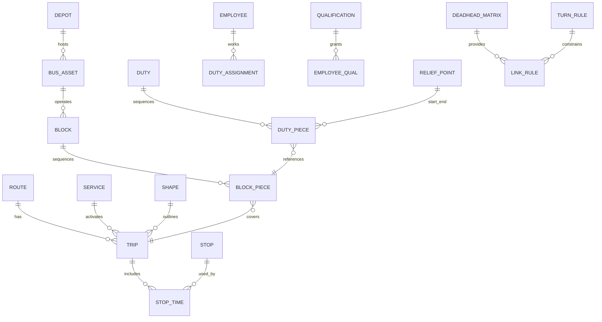

目的
GTFS（General Transit Feed Specification）からバスの「行路（Block）」と「交番表（Roster）」を作るための入力データ、結合ロジック、評価指標を定義します。最適化や自動配置は前提に入れず、GTFSと追加の業務データを組み合わせて“詰め具合”と“運用適合性”を判定できる形にします。手元の群馬中央バスのGTFS（2025-04-01版）を例に、下限台数などの実数も示します。以降の各節は、用語定義→必要データ→結合→評価→次工程という流れで接続します。

用語の定義
行路は「1台の車両が特定日で担当する運行の連なり（営業運行・回送・待機を含む）」です。交番（Duty）は「1人の乗務員が特定日で担当する乗務・中休・点呼のまとまり」です。交番表（Roster）は「従業員×日付にDutyを割り付けた一覧」を指します。交代所（Relief point）は乗務員が交代できる地点で、車庫（Depot）は車両の所属・出入庫拠点です。以降はこの用語で全体を接続します。

必要データ（GTFS由来）
まず、GTFSの標準ファイルを最小集合として使います。routes.txt（路線）、trips.txt（便）、stop_times.txt（時刻表）、stops.txt（停留所）、calendar.txt / calendar_dates.txt（運行日）、shapes.txt（経路形状）です。群馬中央バスのフィードには routes:11、trips:267、stops:369、stop_times:6,973、service_id は「平日」「土日祝」「年末・年始」が含まれ、trips.txt に block_id は存在しません（0件）。block_id が無い前提で、stop_times から便の開始時刻・終了時刻を作り、後段で連結します。ここまでを踏まえ、次でGTFSに不足する運用情報を定義します。

必要データ（業務ドメイン）
行路と交番を評価するには、GTFSに加えて以下の業務データが必要です。

* 車両データ：BusAsset（vehicle_id, vehicle_type, 所属depot_id, 乗車定員, 車椅子可否, ノンステ/ハイデッカ, 台数）。これにより配車可能性を判定します。
* 車両タイプ：VehicleType（type_id, 物理仕様, 路線要求との適合条件）。路線・便ごとの機材指定の整合を評価します。
* 車庫・交代所：Depot（depot_id, 位置, 収容台数）, ReliefPoint（relief_id, stop_id or 位置, 交代可否時間帯）。出入庫や乗務交代の成立可否を見ます。
* 死蔵移動と折返し：DeadheadMatrix（from_stop_id, to_stop_id, 所要分）, MinTurnTime（route_id or terminal_id, 最低折返し分）。便連結の実現性を判定します。
* 従業員：Employee（employee_id, 所属, 雇用区分, 有効期間）, Qualification（大型二種, 研修, 路線認定）, Availability（勤務可能日・時間帯）。交番適合性を評価します。
* 労務ルール：DutyRule（1日拘束上限, 運転上限, 休憩要件, 勤務間インターバルなどの閾値名と値）。法令・協定の制約チェックに使います。
* コスト任意：UnitCost（運転分, 待機分, 回送km, 超過分の単価）。“良さ”を単一指標に圧縮するときに使います。
  この業務データは後述の行路・交番生成ロジックと結合し、評価に使います。

GTFS→ドメインの基本マッピング
Routes（route_id, …）→ 路線。Trips（trip_id, route_id, service_id, direction_id, shape_id）→ 便。StopTimes（trip_id, stop_id, arrival_time, departure_time, stop_sequence）→ 便の時間軸。Stops（stop_id, name, lat, lon）→ 停留所と交代所の候補。Calendar / CalendarDates → 運行日の拡張（サービス日）。Shapes → 地理的距離の近似や回送距離の推定に補助的に使用。これらを最小キー（route_id, trip_id, stop_id, service_id）で結合します。次に連結手順を定義します。

結合ロジック（行路生成：最適化なし）
まず、trip_id ごとに start_time＝最初のdeparture、end_time＝最後のarrival を作り、同一 service_id 日における時間区間［start, end］を得ます。次に、便の終点 stop と次便の始点 stop が一致し、start_next ≥ end_prev + MinTurnTime を満たす候補を“自然連結”とします。終点と始点が異なる場合は DeadheadMatrix 所要分を加え、start_next ≥ end_prev + deadhead + MinTurnTime を満たせば“回送連結”とします。貪欲法で「最も早く空く行路末尾」に次便を順に差し込み、不可なら新規行路を開始します。この結果の行路数は「必要車両台数（推定）」であり、同時稼働本数の最大値が理論的下限になります。次節で交番生成を定義します。

結合ロジック（交番生成：割付のみ）
作成済みの行路を「乗務区間（Piece）」に分割し、ReliefPoint 上でのみ交代可能とします。Piece は区間ごとに from_time, to_time, from_stop, to_stop を持ち、待機や中休は非運転 Piece として扱います。Employee の Availability と Qualification を満たし、DutyRule の拘束・運転・休憩の各閾値を満たすように、Piece を束ねて Duty を作ります。割付自体はドラッグ＆ドロップや簡易な先着割付でよく、評価は後述の指標で行います。これにより“交番表の妥当性”を可視化できます。

評価指標（行路の質）
同時計測下限：LowerBoundVehicles＝同時稼働本数の最大値（service_id 日単位）。アイドル率：IdleRatio＝∑待機分÷∑行路稼働分。回送率：DeadheadRatio＝∑回送分÷（∑営業運転分＋∑回送分）。折返し充足：TurnFeasibility＝MinTurnTime 違反件数。拠点適合：DepotBalance＝行路開始・終了のDepot整合度と収容超過の有無。機材適合：VehicleMatch＝VehicleType要件との一致率。これらをカード指標で提示し、交番に橋渡しします。

評価指標（交番の質）
労務適合：DutyCompliance（拘束・運転・休憩・勤務間の各違反件数）。交代成立：ReliefFeasibility（交代所・時間帯の成立率）。公平性：Fairness（週・月の総運転分・早番遅番の偏り指標）。資格適合：QualificationMatch（路線別要件との一致）。コスト：DutyCost＝運転分単価×運転分＋待機単価×待機分＋回送単価×回送km。これらを合成して交番表の健全性を一点で比較できます。

例（群馬中央バスGTFSからの下限台数）
本フィードで便区間を作り、service_id ごとに同時稼働本数の最大値を算出しました。平日は 11 本（08:45）、土日祝は 9 本（17:20）、年末・年始は 1 本（08:55）で、車両必要台数の理論下限はそれぞれ 11 台、9 台、1 台です。block_id が無いので実行上は MinTurnTime と DeadheadMatrix によって実台数が増えます。従って、行路連結のルール設定が“台数見込み”に最も影響します。次の可視化でデータの結合関係を確認してください。

データのつながり（ERの骨子）
下記は必要エンティティの関係を示す簡易ERです。GTFSの標準キーで土台を作り、業務エンティティで運用可否と評価をのせます。読みながら各テーブルの主キー・外部キーを実装に落とし込めます。次に出力スキーマ例を提示します。

出力スキーマ（CSV/テーブルの例）

* 行路（blocks）: block_id, service_id, vehicle_type_id, depot_id, start_time, end_time, total_drive_min, total_deadhead_min, total_idle_min, turn_violations, depot_mismatch_flag。行路単位の評価をここに集約します。
* 行路明細（block_pieces）: block_id, seq, piece_type(運転/回送/待機), trip_id(nullable), from_stop_id, to_stop_id, from_time, to_time, duration_min。交番生成の原料になります。
* 交番（duties）: duty_id, service_id, depot_id, start_time, end_time, drive_min, break_min, duty_compliance_score。交番単位の適合性を保持します。
* 交番割付（duty_assignments）: duty_id, duty_date, employee_id, qualification_ok, comments。従業員単位の配賦を表に出します。
* 従業員（employees）: employee_id, employment_type, depot_id, availability_pattern, active_from, active_to。交番割付の検索条件に使います。
* 交代所（relief_points）: relief_id, stop_id, allowed_time_window, note。交代成立判定に必要です。
* 連結ルール（link_rules）: from_stop_id, to_stop_id, deadhead_min, min_turn_min, allowed_flag。行路連結の可否をここで制御します。
  これらの出力はそのまま画面とレポートの両方で利用できます。

実データに即した結合・評価の最少手順

1. trips×stop_times から各 trip の［start, end, from_stop, to_stop］を作る。2) service_id ごとに時間順へ並べ、MinTurnTime と DeadheadMatrix を適用して貪欲に連結し blocks / block_pieces を得る。3) block_pieces を ReliefPoint で分割して duty_pieces を作る。4) DutyRule を当てて duty を束ね、違反やアイドルを集計する。5) employees と qualifications を突き合わせ、duty_assignments を付与して交番表を仕上げる。この一連で“隙間を詰める”と“適合性を評価する”の両立ができます。

必要な前提（最小の仮定）
MinTurnTime と DeadheadMatrix は運用実態に合わせて手当し、未整備区間は保守的な所要分で仮置きします。ReliefPoint は stops から候補を選び、交代可否の時間帯を別途設定します。労務パラメータ（拘束・運転・休憩など）は数値をテーブル（DutyRule）で差し替え可能にします。これらの仮定を置けば、最適化なしでも評価一式が安定します。

参考（例から見た下限の解釈と次工程）
同時稼働の最大値は「理論下限」であり、回送や折返しの制約で実行路台数は増えます。群馬中央バスの例では平日11台・土日祝9台・年末年始1台が下限で、MinTurnTime と DeadheadMatrix を入れて連結すれば“必要台数の見積り”が得られます。ここまでのデータ定義とロジックを実装すれば、行路CSVと交番CSVを毎フィード更新で再生成できます。続きとして、最小のDDLやサンプルCSV雛形も提示可能です。
